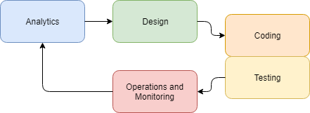
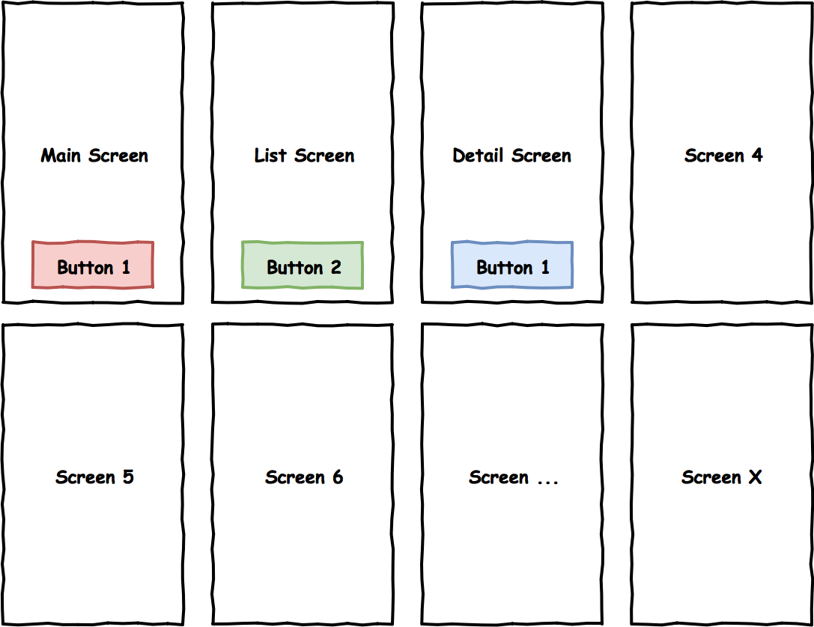
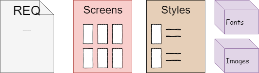

# 1. Initial project documentation

The key idea with which we begin can be summarized as follows:

**A mobile business application is primarily a user interface for interacting with an external service.**

When developing technical documentation for a project, this should be kept in mind, since the interface is the most obvious part and it's easier to divide the project into sections based on it. In fact, the domain model itself is very well described by the user interface - it must take into account basically those data \(and their derivatives\) that are entered by the user, displayed on the screen, and that control its behavior. Business scenarios are also directly tied to the behavior of the user interface.
 
At the same time, most Requirements docs are prepared for business customers and describes not specific screens or classes, but rather whole business scenarios and functional blocks. Then this documentation and graphic design specifications are used by the development team. For coding and subsequent implementation, multiple re-reads and retellings of Requirements docs are used.

In the following chapters, we will describe the minimum required set of documents that will allow the team to use simple checklists to monitor implementation.

Before we move on to parsing artifacts and extracting useful data from them, let's look at the development process as a whole. For simplicity, we've chosen a linear development process, because the same task classes arise with the use of cyclical or spiral methodologies; only the sequence of their execution may differ.

So, the project usually allocates the following task production classes:

* analysis;
* design;
* coding;
* testing;
* operations.

You can find even more, but they will in fact be derived from those above.

At the Analytics stage you should gather general requirements for the application. As a result of the Analytics, specifications appear that are introductory for the graphic design phase.
 
Since our guide is intended primarily for developers, we'll suppose you're working with the brief or full Requirements docs.

Then the most interesting part begins - the design of the user interface. This stage is key and, with the right approach, greatly facilitates and simplifies the development process. If this stage is skipped, the success of the project will depend only on the team's experience.

**At the design stage, the most important thing is to think through the user interface and create screen schemes.**

If you start right away from the graphic design (instead of the black&white screen schemes), you will have to constantly re-work the design to obtain the customer's agreement. At the software design stage, this will greatly slow down the process. The graphic design is actually derived from UX and fills the original schemes with emotions, straightens out the composition, and adds animation and other aspects of appearance and visual behavior. The screen schemes, in turn, create the structure of the application and data models - what data to display, how data fields will be grouped, and how they will affect the interface behavior.

When the software design phase is complete, a set of necessary specifications and resources will result, which together with the Requirements doc will be brought to the developer. It is reasonable to start the coding step with building a foundation - the basic structure of the project, in which understanding of key user scenarios will help us a lot.