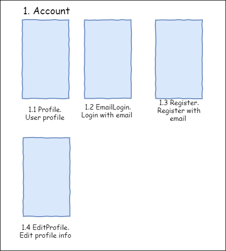

# 2. Screens, data and logic

Let's recall once again that mobile applications are primarily a user interface; therefore, it is better to start designing the screen layouts and the sequence of transitions between them. This is necessary in order to determine the set of steps that the user has to go through in order to obtain the desired result. After all, a business application is created for a specific set of key scenarios \(user interaction sequences\), through which a person can solve tasks.


Since the average time of contact of a person with a smartphone is only a few minutes, the number of steps in business applications should not be large - for the user first of all it is important to get the desired result \(fulfill the task or satisfy the need\) during the time of contact with the device. For complex applications with a lot of functionality, this factor should be kept in mind. A good choice would be to split the application into relatively short scenarios of not more than 10 steps each.


In order to determine the depth of key scenarios, you can use a Map of Transitions and States. We'll discuss this further in Section 2.3. But first you need to tidy up the interface structure.

## 2.1 Screen Grouping and Naming

So, we have on hand screen schemes from the designers and a sequence of transitions between them.


In order to split the application into parts \(sections of the Business Domain Model\), we will start with the screens. Once again, we recall that the mobile application is primarily an interface with the user, so our screens are a direct reflection of the available domain model.


The first thing to do is to select screens that are linked together. They usually have to go one after the other in user scenarios. For example, often in applications you can select the ___Account___ section, where users can view and edit all the information associated with their user profile.



If you are an experienced developer, you can easily deal with splitting the list of screens into related sections. In any case, it takes a little practice.

So, we can get the following sections:

```
1. Account
2. Help
3. Checkout
4. Catalog
```

Each section must have a name and number. Section names should be used to split the data layer, business logic, and user interface horizontally. This will make it easier to further develop the project.

For example, the data layer \(groups of methods for different server APIs\) in this case will be divided into sections \(Repositories, if that's the term you're used to\), each of which will serve its own set of screens:

---

**DAL\DataServices \(Repositories\)**

```
AccountDataService.cs (or AccountRepository.cs)
HelpDataService.cs
CheckoutDataService.cs
CatalogDataService.cs
```

---

After that, each of the repositories can completely hide all the work with the server, disk cache and local database. This will allow working with repositories at the level of business logic as with black boxes.

Then you must number and name screens \(pages, windows\). At the output we will get a tree-like \(albeit flat\) interface structure without regard for the sequence of transitions between screens and their nesting.


Screen names will be used in our class names for the corresponding pages \(Page\) and ViewModel \(or Controller for MVC\):

---

**1.1 Profile**

```
ProfilePage
ProfileViewModel
```

**1.2 EmailLogin**

```
EmailLoginPage
EmailLoginViewModel
```

---

This is important most of all for developers who actually get the completed project structure:

* The data layer is divided into sections of the application - we'll create a Data Access Layer \(DAL\) structure.

* Then we add the necessary Pages and ViewModels - this creates a layered structure for working with the user interface \(UI\) and business logic \(BL\).

As you can see, the project skeleton is already emerging. The DAL layer can easily be allocated to a separate library. If you use a typical architecture or a project template \(Base classes, NavigationService, etc.\), then you already have the backbone of the application.

An example of the project structure is shown below.

---

**UI \(User Interface\)**

```
\Pages
    \Account
        ProfilePage.xaml
        ...
```

**BL \(Business Logic\)**

```
\ViewModels
    \Account
        ProfileViewModel.cs
        ...
```

**DAL \(Data Access Layer\)**

```
\DataObjects (Models)
    ProfileObject.cs (ProfileModel.cs)
    ProductObject.cs
    ...

\DataServices (Repositories)
    AccountDataService.cs
    ...
```

---

In order to further implement the behavior of each screen, we will need additional information, so we will continue to get acquainted with the necessary artifacts.

## 2.2 Table of Screens

After we have the screen schemes, we can also analyze them before actually starting development. The next useful artifact for us will be a table of screens, which will be useful not only for developers, but also for testers. In the summary table, it is easy to put all the textual information together. The key columns of the table are:

1.	Screen number
2.	Short Name \(Name\)
3.	List of possible states \(States\)
4.	Input fields for Validation
5.	Description of the screen and its behavior \(Behavior\)

As you can see, the presented set of fields collects that information, which will allow us to correctly check the operation of each screen separately. You can also assign a color to each section - this will simplify the work with the map of transitions and states.


   
Additionally, the following columns can be added to this table:

6. List of pop-up notifications \(alerts, sheets, dialogs\)
7. UI-control identifiers \(for example, LoginButton\) for writing automated UI-tests
8. Models/DataObjects used in ViewModel
9. DAL methods used on each screen
10. Styles

You can just enter short notations about each screen on the columns, which will be used later on in the program code and comprehensible to the developers. Besides the Behavior column \(Description of the screen and its behavior\), it's better not to make any restrictions here.

Let's take a look at the screen states separately. Most modern applications run over the Internet, so it should display the information about the downloading state correctly:

* display progress bar;
* display downloaded data;
* display a message about the absence of an Internet connection;
* display an error message (server is unavailable, server errors);
* display a stub if the server returned empty data (for example, an empty list).


A good practice would be to make sure each screen downloading data from the network \(or from a local database\) correctly displays each of the described states to the user. Practically speaking, a separate state is described by its set of visual elements \(texts, pictures, buttons, other elements\), and at the program code level it is easy to control by switching from one state to another. You can also record negative scenarios \(load error, empty data\) for further analysis and elimination on the server or application side.

You can take this as a rule and add state switching to all screens loading data. This will simplify the interaction of the user with the application. You can also use different animations or graphics in negative states \(errors, empty data\) to smooth out the effect.

So, we already have screen layouts, a Page list and a ViewModel, as well as detailed information for each screen. The application framework can be built, but now we have screens described independently from one another and there is no clear and understandable sequence of transitions. Therefore, the next useful artifact for us will be a map of transitions and states.

## 2.3 Map of Transitions and States \(User Flow Map\)

You can use a map of transitions and states to better understand the basic user scenarios, and also to identify the connections between the screens. The map's advantages are its compactness and visibility. Even for large projects, the map of transitions can be printed on an A4 printer and hung over the desktop.

The transition map begins with the starting point - the moment the application was launched by the user. There can be several starting points, for example, one launch option for an authorized user, another for an unauthorized user, and a third for a Push notification.

Next, rectangles are added for each screen and denoted by the arrows of the sequence of transitions. You can add the AutomationId of the buttons or events that caused the transition, and for clarity still specify the data that will be transferred to the new screen.

Also, we already have a table of screens \(see the previous chapter\), where the possible states of each of them are indicated and which must be displayed on the transition map. This will allow you to better understand the possible interruptions of user scenarios, for example, in the case of errors or empty data. If the state interrupts the user scenario \(the person can not go further\), then we denote this with a minus sign "-"; if not, then we put a plus "+". You don't have to add the "back" arrows.


As you can see, now we have practically all the information necessary for development in a compact form. These three online documents \(a list of screens, a table of screens, and a map of transitions\) can be updated as the project improves.

To create the artifacts described above, we will only need three online tools:

- text editor \(Example: Google Docs, MS Word Online\)
- table editor \(Google Docs, MS Excel Online\)
- graphic editor \(Draw.io, Google Docs, Visio Online\)

The preparation of each of the artifacts takes no more than one day, but it greatly simplifies the process of development, testing and further improving of the product later on. During the meditative preparation of documents and schemes, the team gains a deeper understanding of the project and can finally evaluate the complexity and duration of its development \(internal estimates\).