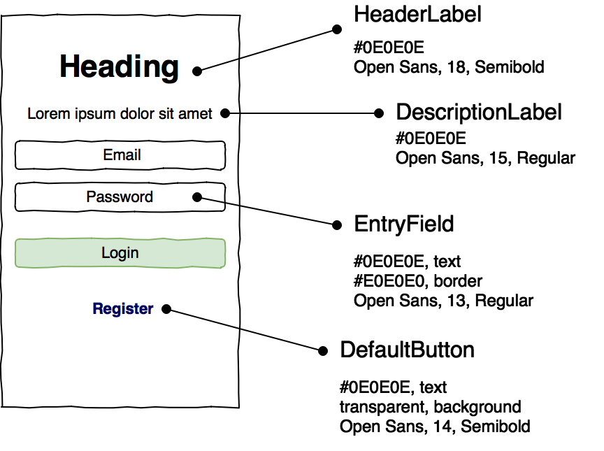
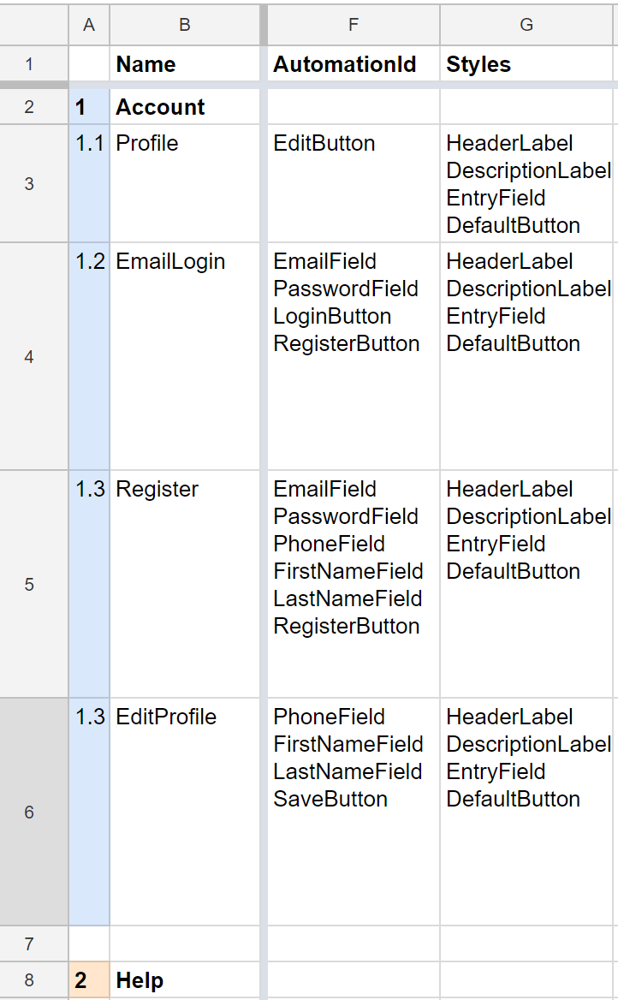

# 3. Styles and Resources

In modern applications with a user interface, style sheets are widely used. In development tools \(both native and cross-platform\), this mechanism is also implemented, so before you start coding it's better to make a single style sheet, because otherwise styles are likely to explosively increase in number. Sometimes each developer comes up with his or her own names for identical elements of the user interface. To avoid this, you need to prepare in advance: you prepare descriptions, or at least the names of styles with references to the graphic design.

The style information should come from a designer \(for example, through a service like Zeplin.io or Sketch\). At this point we must have not only a set of properties for each type of object \(font color for the text, background for the page, and so on\), but their connection to the pages as well. All objects on the screen have to specify the names of the styles associated with them.

Based on this table, you can immediately describe the styles you'll need in the early stages of the project, which will allow you to focus on the layout, not styling, of the interface elements during the design phase.

The next step is to look at the functionality that can be hidden from the user.
