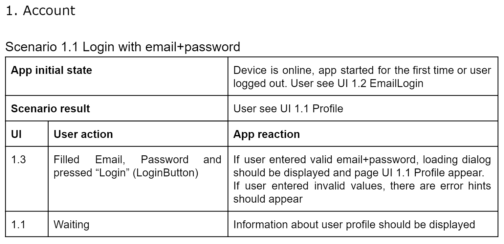

# 5. User scenarios

As we noted in Chapter 1, all applications are created to solve specific user tasks. So an app is in fact a set of transitions between screens and user actions \(clicking on a button, selecting an item, etc.\). Therefore, we also tie our scenarios to screens and elements of the user interface.

---

---

As you can see, the scenarios contains elements of the user interface, which will make it easier to transfer them to automated UI testing in the future.

Now we have all the necessary information for both development and testing \(manual and automated\).

