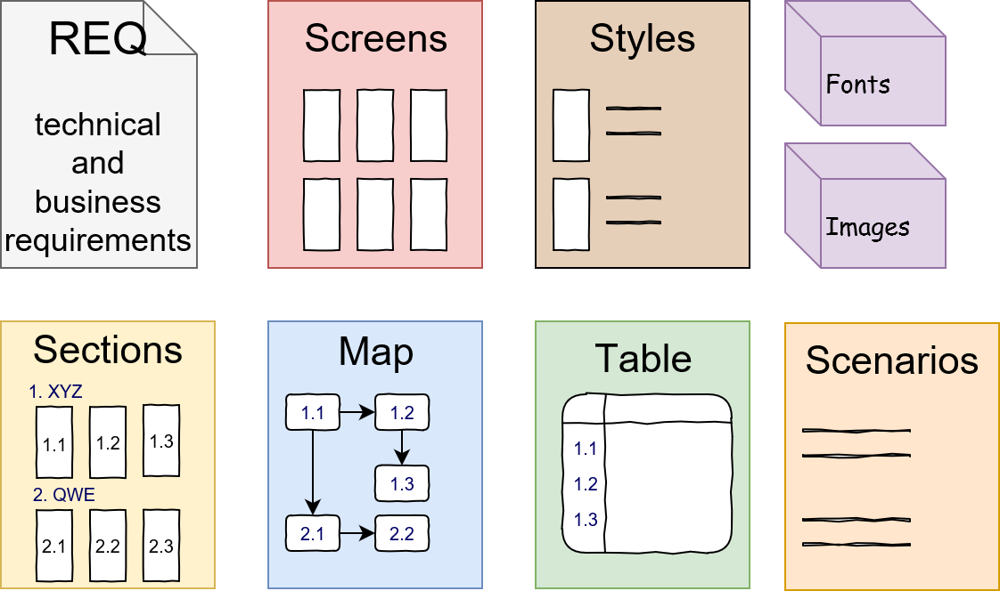

# 6. The final set of artifacts

In addition to the original Requirements doc and Graphic Design, we also received a set of additional artifacts.

Each of the artifacts requires relatively little time to create and does not require complex knowledge and experience. Together they fully describe the application and the entire user experience. These documents can be created even by specialists of medium level, and docs use greatly simplifies and structures further development.
 
Regardless of whether you use simple online documents or a special requirements management system, you should update the documentation for every major release. It's worthwhile to make sure the names mentioned in the document are used by the whole team when writing code, scripts and planning work \(for example, splitting backlog tasks up by sections\).