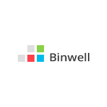

# Conclusion

When starting long projects, pay attention to the preparation of technical documentation for the entire team, not just the business customer. In our manual, we described a simple set of artifacts which allows you to look at the entire project \(user flow map\), on one hand, and on the other - to get only the most necessary information for each screen or module \(table\).

So, a brief description of each artifact:

* **List of screens by sections.** Used for naming and numbering screens. Allows you to find a screenshot by number or name. Will be used by developers and testers.

* **Table of screens.** Allows you to get some brief information on each screen, including a description of its behavior and appearance. The names in the table will correspond to the names in the code. Will be used by developers and testers.

* **Map of transitions.** Allows you to see all possible user scenarios and the entire user interface map. Will be used by developers and testers.

* **User scenarios.** Describe the interaction with the user in the mode of "user action" - "system reaction," in connection with the screens. Will be required only by the testers.

We hope that this approach will simplify your team's work with documentation and allow you to create high-quality mobile applications faster. 

---

Slava Chernikoff, slava@binwell.com

Our contact info: [binwell.com](https://binwell.com), +7 \(499\) 677-49-27, contact@binwell.com.

You can also subscribe to our Medium, where we often post interesting materials on cross-platform mobile applications development on Xamarin and Xamarin.Forms, and material on architecture and development technologies, as well as Mobile DevOps: [medium.com/binwell-blog](https://medium.com/binwell-blog)

